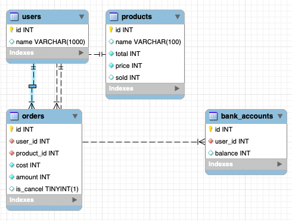

# SQL Transaction
使用 MySQL，帳號密碼為
```
root: root
root_password: my-secret-pw

user: api-server
password: hello-world
```
一個是 root user 一個是普通 user，如果是 api server 連線 MySQL，可以參考
```js
const knex = require('knex')({
    client: 'mysql2',
    connection: {
        host: 'localhost',
        user: 'api-server',
        password: 'hello-world',
        database: 'online-transaction'
    },
    acquireConnectionTimeout: 60000,
    pool: {
        min: 5,
        max: 10
    }
});
```

以下是 DB Schema   
  
線上版：https://www.db-fiddle.com/f/sd6JThdho2wruTt2iq58Rg/4  

或是可以用 MySQL Workbench 連線進去看喔  

## 如何執行
### 1. 初始化資料庫  
使用 `$ docker-compose up` 啟動，會需要約 2 分鐘啟動時間，terminal 會跑出一些 log，需要等到
```
init-script_1  | finished!
sql-transaction_init-script_1 exited with code 0
```
才代表資料庫初始化完成  
### 2. 啟動 api server
開啟新的 terminal，自行啟動 api server，預設 port 為 3001，實作就留給各位    
可以參考我的實作 https://github.com/sj82516/online-transaction-challenge-implementation/tree/master/sql-transaction  

### 3. 執行測試
確認 api-server 啟動後，呼叫 `$ docker run -it -e action=test yuanchieh/online-transaction:sql-transaction`，如果有指定的 api server url，可以透過 `-e api_host=http://hello.com:8080` 指定，需要注意 docker 的 localhost 指定為題    
運行中 log 會打出完成的 request 數量，預計會在 2 分鐘內完成 2000 多個 request，沒有全部成功是合理的，會故意製造一些用戶餘額不足以及商品不夠賣的邊際問題        
```
total 2456 request, avg execution time : 920.1095276872965 with total 2412 success reqeust
```    

### 4. 最後執行驗證
`$ docker run -it -e action=validate yuanchieh/online-transaction:sql-transaction`，不論錯誤成功都會有打印    
```
start sql transaction validation, it would take around 1 minutes.
Congradulations! Your service complete 2426 orders and erned $3501049 successfully.
```

如果有錯誤
```
start sql transaction validation, it would take around 1 minutes.
Error: There are 1 users with total inbalance money $-400
```

5. 如果要重新來過，記得把資料庫停下來，把 `docker-compose up` 的 terminal 終止指令，要重啟記得先 `$ docker container prune` 清除終止的 container，重新執行 `$ docker-compose up`才會有全新的資料庫喔  

